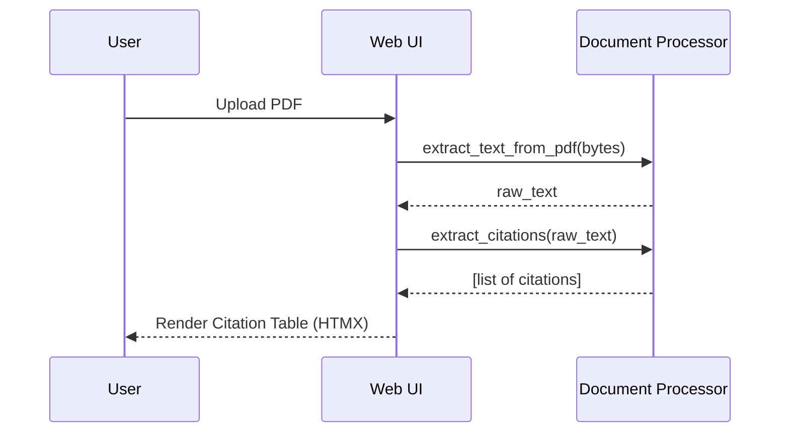
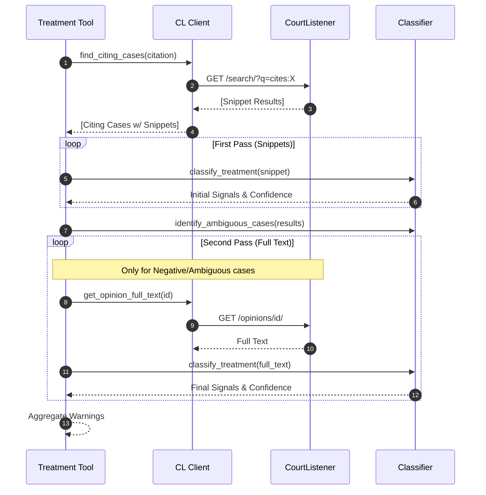
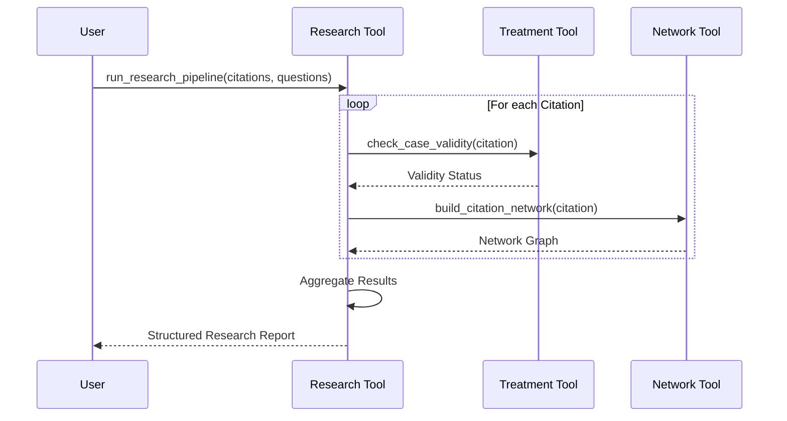
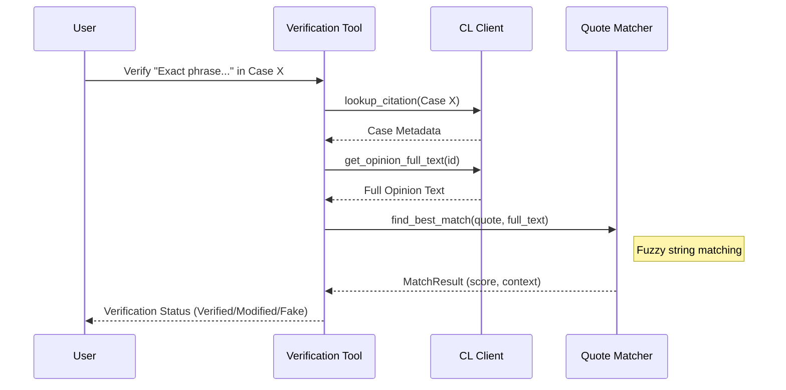
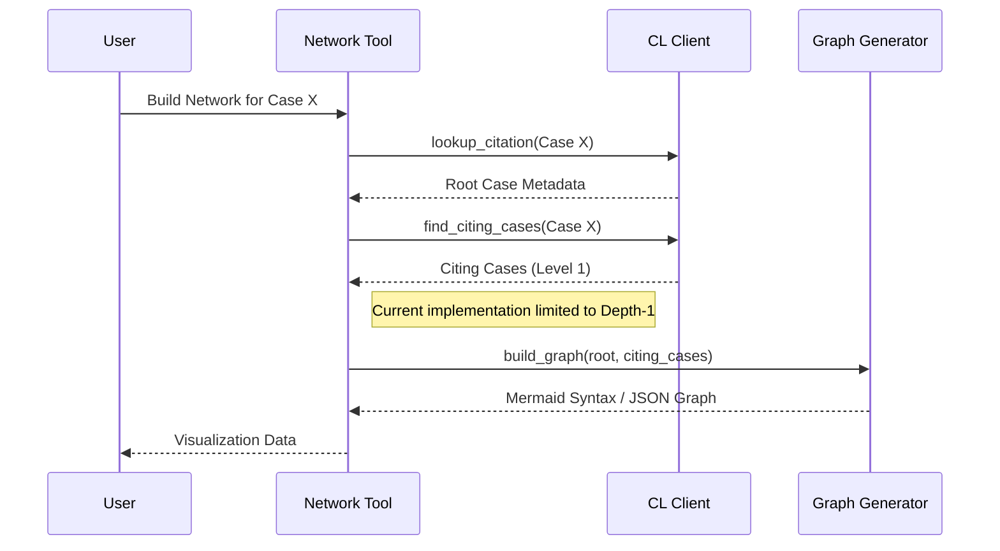

# System Architecture

## Table of Contents
1. [System Overview](#1-system-overview)
2. [Module Documentation](#2-module-documentation)
3. [Data Flow & External Integrations](#3-data-flow--external-integrations)
4. [Workflows](#4-workflows)
5. [Reference Documentation](#5-reference-documentation)

---

## 1. System Overview

The **Legal Research Assistant** is a dual-interface application designed to enhance legal research capabilities. It provides advanced tools for citation analysis, treatment verification ("Shepardizing" alternative), and citation network visualization.

The system follows a **Shared Core Architecture**, where the core business logic and analysis capabilities are implemented once and exposed through two distinct interfaces:
1.  **Web UI (FastAPI + HTMX):** A responsive, high-density interface for human legal researchers.
2.  **MCP Server:** A standard Model Context Protocol server for AI assistants (e.g., Claude, IDEs).

### Component Diagram

```mermaid
graph TB
    subgraph "Interfaces"
        Web[Web UI\n(FastAPI + HTMX)]
        MCP[MCP Server\n(FastMCP)]
    end

    subgraph "Orchestration Layer (app/tools)"
        Treatment[Treatment Tool]
        Research[Research Tool]
        Network[Network Tool]
        Verify[Verification Tool]
        Search[Search Tool]
    end

    subgraph "Analysis Core (app/analysis)"
        Classifier[Treatment Classifier]
        DocProc[Document Processor]
        GraphGen[Network Generator]
        Matcher[Quote Matcher]
        Vector[Vector Store\n(ChromaDB)]
    end

    subgraph "Infrastructure"
        Client[CourtListener Client]
        Cache[Cache Manager\n(File-based)]
    end

    subgraph "External"
        CL_API[CourtListener API]
    end

    %% Connections
    Web --> Treatment
    Web --> Research
    Web --> Network
    Web --> Search
    Web --> DocProc

    MCP --> Treatment
    MCP --> Research
    MCP --> Network
    MCP --> Verify
    MCP --> Search

    Treatment --> Classifier
    Treatment --> Client
    Research --> Treatment
    Research --> Network
    Research --> Verify
    Network --> GraphGen
    Network --> Client
    Verify --> Matcher
    Verify --> Client
    Search --> Vector
    Search --> Client

    Classifier --> Client
    Client --> Cache
    Client --> CL_API
```

### Key Design Patterns
*   **Shared Core:** Logic is centralized in `app/analysis` (pure domain) and `app/tools` (orchestration), ensuring consistency across both Web and MCP interfaces.
*   **Orchestrator Pattern:** `app/tools` modules coordinate multiple lower-level analysis steps (e.g., fetching citations -> classifying sentiments -> aggregating results) into a single coherent operation.
*   **Two-Pass Analysis:** Used in Treatment Analysis to optimize performance. A fast "snippet-only" pass identifies potential issues, followed by a "smart selection" pass that fetches full text only for ambiguous or negative citations.
*   **Gateway Pattern:** `CourtListenerClient` acts as the single gateway for all external API interactions, handling rate limiting, retries, circuit breaking, and caching.

---

## 2. Module Documentation

### Interfaces

#### `app/api.py` (Web Backend)
*   **Purpose:** Serves the Web UI using FastAPI and Jinja2 templates. Handles HTMX requests for partial updates.
*   **Responsibility:** Route handling, file uploads, template rendering, and calling into `app/tools` for logic.
*   **Dependencies:** `app/tools/*`, `app/analysis/document_processing`.

#### `app/server.py` (MCP Server)
*   **Purpose:** Exposes capabilities to AI agents via the Model Context Protocol.
*   **Responsibility:** Tool registration, request validation, and formatting results for LLM consumption.
*   **Dependencies:** `fastmcp`, `app/tools/*`.

### Orchestration Layer (`app/tools/`)

#### `app/tools/treatment.py`
*   **Purpose:** Implements the "Shepardizing" workflow (checking if a case is good law).
*   **Responsibility:** Orchestrates the fetching of citing cases, running the two-pass classification strategy, and aggregating warnings.
*   **Dependencies:** `CourtListenerClient`, `TreatmentClassifier`.

#### `app/tools/research.py`
*   **Purpose:** Orchestrates multi-step analysis on a list of citations.
*   **Responsibility:** Takes a list of citations and runs treatment analysis, network building, and quote verification for each, aggregating the results into a single report.
*   **Dependencies:** `app/tools/treatment.py`, `app/tools/network.py`, `app/tools/verification.py`.

#### `app/tools/network.py`
*   **Purpose:** Analyzes citation networks.
*   **Responsibility:** Builds graphs of citing/cited cases to visualize legal precedence.
*   **Dependencies:** `CourtListenerClient`, `app/analysis/citation_network.py`.
*   **Limitations:** Current implementation fetches only direct citations (Depth-1). Recursive fetching for deeper networks is not yet implemented.

#### `app/tools/search.py`
*   **Purpose:** Performs semantic search for legal cases.
*   **Responsibility:** Implements the "Smart Scout" strategy: fetching candidates from CourtListener, downloading full text, indexing in local vector store (ChromaDB), and performing semantic re-ranking.
*   **Dependencies:** `CourtListenerClient`, `app/analysis/search/vector_store.py`.

#### `app/tools/verification.py`
*   **Purpose:** Verifies the accuracy of quotes.
*   **Responsibility:** Fuzzy matching user-provided quotes against the official case text.
*   **Dependencies:** `CourtListenerClient`, `app/analysis/quote_matcher.py`.

### Analysis Core (`app/analysis/`)

#### `app/analysis/treatment_classifier.py`
*   **Purpose:** Core logic for determining if a citation is positive, negative, or neutral.
*   **Responsibility:** Parsing text, identifying signal keywords (e.g., "overruled", "affirmed"), and assigning confidence scores. Pure domain logic.
*   **Dependencies:** None (Pure Python).

#### `app/analysis/document_processing.py`
*   **Purpose:** Handles user-uploaded documents.
*   **Responsibility:** Text extraction from PDFs (via `pypdf`) and regex-based citation extraction.
*   **Dependencies:** `pypdf`.

#### `app/analysis/citation_network.py` & `mermaid_generator.py`
*   **Purpose:** Graph data structures and visualization.
*   **Responsibility:** Processing graph nodes/edges and generating Mermaid diagram syntax.
*   **Dependencies:** None.

#### `app/analysis/search/vector_store.py`
*   **Purpose:** Semantic search capability.
*   **Responsibility:** Manages the local ChromaDB instance for storing and querying case embeddings.
*   **Dependencies:** `chromadb`, `sentence-transformers`.

### Infrastructure

#### `app/mcp_client.py` (CourtListener Client)
*   **Purpose:** Robust gateway to the CourtListener API.
*   **Responsibility:** Authentication, Rate Limiting (Circuit Breaker), Retries (Backoff), and Caching integration.
*   **Dependencies:** `httpx`, `tenacity`, `app/cache.py`.

#### `app/cache.py`
*   **Purpose:** Local caching layer.
*   **Responsibility:** File-based caching with granular TTLs for different data types (Metadata, Text, Search Results).
*   **Limitations:** Currently file-based; a distributed cache (e.g., Redis) is planned for production scaling.

---

## 3. Data Flow & External Integrations

### Data Flow
Data typically flows in this direction:
1.  **Input:** User/LLM provides a citation or query.
2.  **Orchestration:** A Tool module accepts the request.
3.  **Retrieval:** The Tool uses `CourtListenerClient` to fetch raw data (cases, opinions).
4.  **Analysis:** Raw data is passed to `app/analysis` modules for processing (classification, graph building).
5.  **Refinement:** If needed (e.g., smart full-text fetch), the Tool requests more data via the Client.
6.  **Output:** Structured results are returned to the Interface (Web/MCP).

### External Dependencies
*   **CourtListener API:** Primary source of legal data.
    *   *Integration:* `app/mcp_client.py`.
    *   *Auth:* Requires API Key.
    *   *Limits:* Rate limited (handled by client).
*   **ChromaDB:** Embedded vector database for semantic search.
    *   *Integration:* `app/analysis/search/vector_store.py`.
    *   *Storage:* Local filesystem.

---

## 4. Workflows

### A. Document Upload & Analysis
User uploads a PDF/TXT file to extract citations.



### B. Treatment Analysis (Shepardizing)
Checking if a case is "good law" using the Two-Pass strategy.



### C. Research Pipeline
Aggregated analysis of a list of citations.



### D. Quote Verification
Verifying if a specific quote exists in a case.



### E. Citation Network Construction
Building a graph of case precedents.



---

## 5. Reference Documentation

For deeper implementation details, consult these documents:
*   [AGENTS.md](./AGENTS.md) - Dev setup, conventions, and testing guide.
*   [FULL_TEXT_ENHANCEMENT.md](./FULL_TEXT_ENHANCEMENT.md) - Deep dive into the Two-Pass Treatment Analysis and Full Text logic.
*   [API_FIX_SUMMARY.md](./API_FIX_SUMMARY.md) - Context on recent CourtListener integration fixes.
